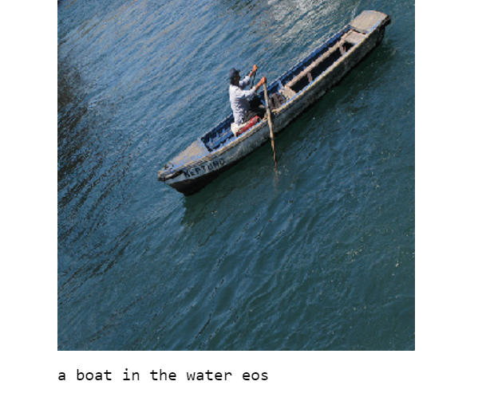

# Image-Captioner

I am using an inject architecture for Xception - LSTM model to generate caption for images. I used pretrained weights from ImageNet for Xception encoder and used pretrained Stanford GloVe word embeddings. 

## Data

I used Flickr 8k dataset which is a collection of 8k images with their respective captions where each image consists five different captions.

## Requirements

Python 3.7

Keras 2.3

Numpy 1.18

Pandas 1.0

Matplotlib 3.1

NLTK 3.4.5

Re 2.2.1

## Results

## Reference

[Deep Visual-Semantic Alignments for Generating Image Descriptions](https://arxiv.org/abs/1412.2306), Andrej Karpathy, Li Fei-Fei
